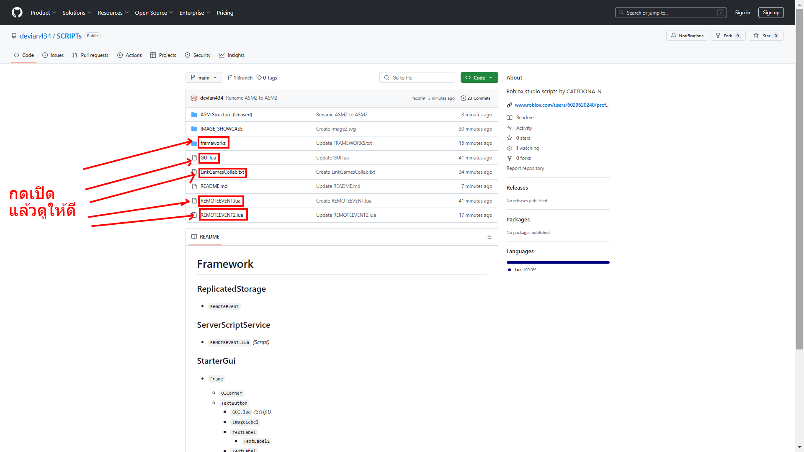

# Framework

## ReplicatedStorage
- `RemoteEvent`

## ServerScriptService
- `REMOTEEVENT.lua` _(Script)_

## StarterGui
- `Frame`
  - `UICorner`
  - `TextButton`
    - `GUI.lua` _(Script)_
    - `ImageLabel`
    - `TextLabel`
      - `TextLabel2`
    - `TextLabel`
    - `TextLabel`
    - `TextLabel`

- `Frame2`
  - `Frame2.lua` _(LocalScript)_
  - `TextLabel`
